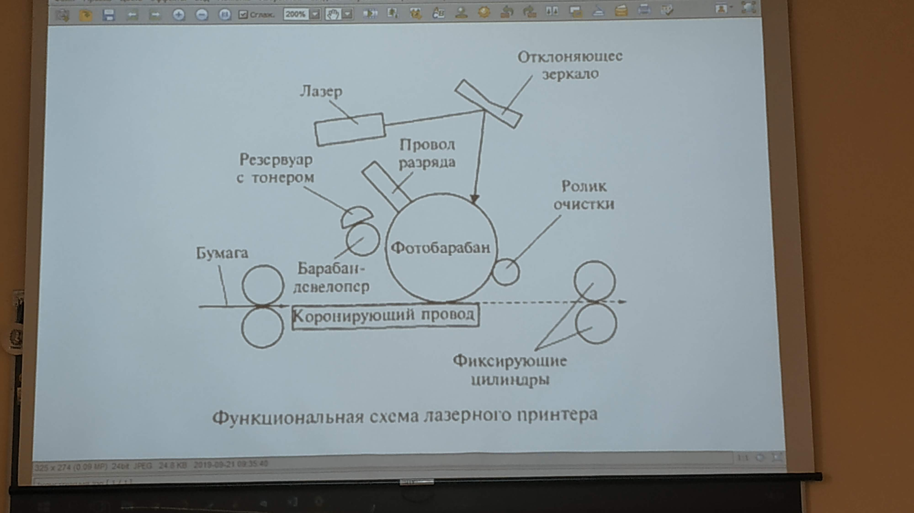
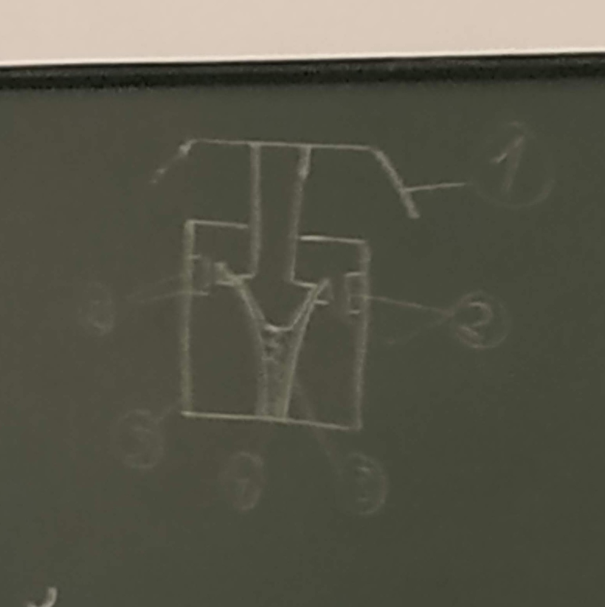
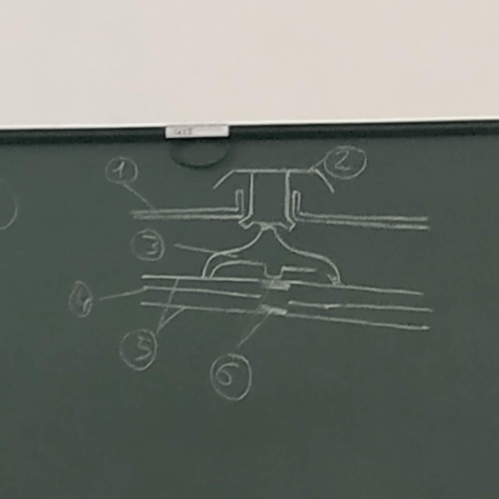
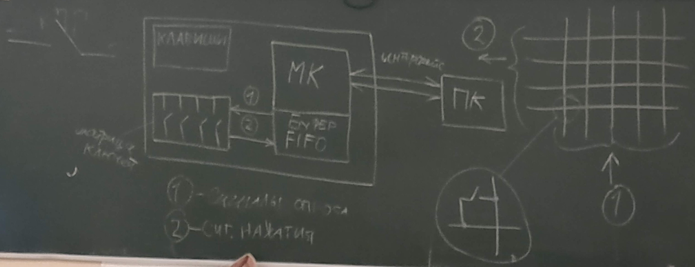

# Вопросы по Архитектуре аппаратных средств

## №18 (Виды корпусов PC)

- Моноблок
  - Rack (для серверного оборудования)
  - Barebone
  - AT (старый, на смену пришёл ATX)
- Горизонтальные корпуса
  - Desktop (Настольные)
  - FootPrint (Напольные)
  - SlimLine (Тонкие)
  - UltraSlim
- Вертикальные корпуса
  - Super/Ultra Tower
  - Full Tower (до 20x60x100 cm)
  - Big Tower (190x482x820 mm)
  - Mid Tower (183x432x490 mm)
  - Mini Tower (178x432x432 mm)
  - Micro Tower (для низко производительных PC)

## №21 (Шины ATA (IDE), SCSI. Основные теоретические сведения)

1. ATA (IDE) - электроника встроенная в привод. Параллельный интерфейс, так же называется PATA (Parallel ATA). Используется для подключения накопителей информации (HDD, CD/DVD ROM).

   Разъём на периферийных устройствах и платах имеют 40 выводов. Соединительный кабель представляет собой 40 или 80 жильный шлейф. При помощи шлейфа можно установить два устройства (master, slave). Макс. длина кабеля 40cm.

2. SCSI (Small Computer System Interface) - параллельный интерфейс, разработанный для объединения на одной шине различных по своему назначению устройств, например как жёсткий диск.

   Контролер SCSI является самостоятельным процессором при этом имеет собственный BIOS. К шине может быть подключено до 15 устройств. С шиной SCSI одновременно могут работать несколько устройств.

   Для подключения используется плоский шлейф на концах которого расположены разъёмы 25, 50, 68 пин. В шине содержится 8 линий данных.

   Имеется два способа передачи данных:
   
   - Однополярный - 1 провод
   - Дифференциальный - используется два провода
   
   Каждое устройство имеет свой ID (либо 0-7, 0-15). Плата контроллера имеет либо ID 7, 15.
   На концах кабелей устанавливается терминатор (для согласования помех и устранения эхо).
   Ширина шины - 8, 16 бит.
   Частота - 5Mhz, 10MHz , 20 MHz, 40 Mhz.
   Физ. реализация - оптический, однополярный, дифференцированный.

## № 22 (Шины SATA и SAS. Основные теоретические сведения.)

1. SATA (Serial ATA) - последовательный интерфейс обмена данными, улучшенная версия ATA (PATA).

   В отличии от 40-контактного разъёма у ATA, SATA использует 7-контактный, а также более устойчив к многократному подключению.

   Разъём питания SATA подаёт 3 напряжения питания: 

   - +12V (жёлтый цвет)
   - +5V (красный цвет)
   - +3.3V (используется не всегда, оранжевый провод)
   - Чёрный провод - заземление.

   Каждому устройству полагается отдельный кабель, что снимает проблему невозможности одновременной работы устройств, находящихся на одном кабеле.

2. SAS (Serial Attached SCSI) - последовательный компьютерный интерфейс, разработанный для подключения различных устройств хранения данных, например жёстких дисков. Разработан для замены параллельного интерфейса SCSI.

   Накопители с интерфейсом SAS можно подключить только к контроллеру SAS. При этом накопители SATA можно подключить, как к контроллеру SATA так и SAS.

## № 23 (Интерфейс ACPI и шина SMBus. Основные теоретические сведения.)

1. ACPI (Advanced Configuration and Power Interface) - общий интерфейс для обнаружения аппаратного обеспечения, управления питанием и конфигурации материнской платы и устройств. В ACPI 2.0 была добавлена поддержка 64-разрядных микропроцессоров для серверов, поддержка различных типов памяти, устройств PCI и PCI-X. В настоящий момент последней версией является ACPI 6.2a.

   Задача ACPI - обеспечить взаимодействие между операционной системой, аппаратным обеспечением и BIOS материнской платы.

2. SMBus (System Managment Bus) - последовательный протокол обмена данными для устройств питания. Используется, например для получения информации о состоянии аккумуляторной батареи ноутбука.

   SMBus - двухпроводной интерфейс, по которому простые устройства могут обмениваться информацией с остальной системой. Благодаря этому:

   -  Уменьшается кол-во проводов
   -  Гарантируется дальнейшая наращиваемость путём приёма сообщений по протоколу I2C.

   Назначение SMBus:
   - Определяет объём и конфигурирует память
   - Предоставляет информацию изготовителя
   - Сообщает системе номер модели и номер по каталогу
   - Сообщает о различных типах ошибок
   - Отключает тактовую частоту на свободных разъёмах памяти
   - Определяет пониженное напряжение батареи

## № 24 (COM-порт, IrDA и LPT. Основные теоретические сведения)

1. COM-порт (COMmunication port) - двунаправленный последовательный интерфейс, предназначенный для обмена байтовой информацией. Стандарт RS-232C.

   Использовался для подключения терминала, позже для модема и мыши. Сейчас используется для соединения с источниками бесперебойного питания, для связи с аппаратными средствами разработки встраиваемых вычислительных систем.

2. IrDA - Infrated Data Association, ИК-порт. Может быть как двунаправленным, так и однонаправленным (сейчас в основном однонаправленный). Основной недостаток который послужил причиной отказа от IrDA - ограниченная дальность действия и требования прямой видимости пары приёмник-передатчик.

3. LPT (IEEE-1284) - используется для подключения к компьютеру принтера, сканера и других внешних устройств. 

## № 25 (Шина USB. Основные теоретические сведения. Стандарты USB. Технология Power Delivery.)

USB (Universal Serial Bus) - универсальная последовательная шина, предназначенная для многократного подключения периферийных устройств.

Для подключения периферийных устройств используется 4-х пиновый кабель (витая пара) до 5m:

- 2 провода отвечают за питание +5V (красный провод), GRD (чёрный провод)
- 2 провода Data+ (зелёный провод), Data- (белый провод)
- 5-й провод оплётка (экран)

Стандарты USB

| Спецификация      |  Скорость  | Стандарт USB                            |
| ----------------- | :--------: | --------------------------------------- |
| High-speed        | до 480Mbps | USB 2.0                                 |
| Superspeed        |  до 5Gbps  | USB 3.0 / USB 3.1 Gen 1 / USB 3.2 Gen 1 |
| Superspeed+10Gbps | до 10Gbps  | USB 3.1 Gen 2 / USB 3.2 Gen 2           |

Inter-Chip USB - упрощённые версии USB 2.0 для некоммутируемого соединения микросхем в одном устройстве. Упрощение достигается за счёт замены физического уровня USB с асинхронного на синхронный, октаза от возможности смены скорости и определения подключения, электрической защиты от электрической защиты драйверов и уменьшения их мощности.

USB-OTG - для подключения периферийных устройств друг с другом без компьютера.

## № 26 (Шина FireWire, порт Bluetooth. Основные теоретические сведения)

1. FireWire (IEEE-1394) - последовательный интерфейс, используется для цифровых видеокамер, внешних жёстких дисков и различных сетевых устройств. Для подключения устройств используется 6 жильный медный кабель или оптоволокно.

   Состав кабеля:

   - 2 провода под питание. Напряжение 8-40V. Ток 1,5A.
   - 4 провода - 2 экранированные витые пары для передачи информации. Макс. длина 4.5m.

   Основные скорости (Mbps): 100, 200, 400, 800, 1600, 3200.

   Типы:

   - Type A (4-pin, 6-pin)
   - Type B (9-pin)

2. Bluetooth - обеспечивает обмен информации между, устройствами на надёжной, бесплатной, повсеместно доступной радиочастоте для ближней связи (2,4-2,4835GHz).

   Версии:

   - Bluetooth 1.0 - 1998
   - Bluetooth 1.1
   - Bluetooth 1.2
   - Bluetooth 2.0
   - Bluetooth 3.0
   - Bluetooth 4.0
   - Bluetooth 4.1
   - Bluetooth 4.2
   - Bluetooth 5.0 - Самый распространённый. Макс. дальность 400m
   - Bluetooth 5.1

   Типы соединения:

   - P2P
   - Звезда
   - Распределённая звезда

## № 40 (Лазерные принтеры. Виды лазерных принтеров. Принцип действия. Достоинства и недостатки.)

Лазерный принтер - один из видов принтеров, позволяющий быстро печатать текст и изображения на бумаге.

Виды:

- Ч/Б
- Цветные

Параметры влияющие на печать принтера:
1. Разрешающая способность 1200dpi
2. Технология улучшения печать (RET, TurboRES)
3. Качество тонера
4. Языки принтера (PCL5, PCL-6, HP-GL, PostScript)
5. Скорость печать

Используется фотоэлектрический метод печати. При помощи лазера "рисуется" изображение на фото чувствительном слое фотобарабана. При этом фотобарабан заряжается напряжением -5kV, в это время барабан-девелопер переносит тонер из бункера на фотобарабан и в систему подаётся бумажный носитель, заряжаясь каранирующим проводом +5kV. После чего лист бумаги проходит через фиксирующий валик при нагревающиеся до 180°С для закрепления изображения. При этом остатки тонера снимаются барабанами очистки.

Компоненты:

1. Процессор
2. Программируемая логическая матрица (ПЛМ)
3. Контроллер электрографического процесса
4. Электромагнитный соленоид
5. Узел считывания

Достоинства:

- Высокая скорость печати
- Хорошая масштабируемость
- Двухсторонняя печать

Недостатки:

- Большое потребление энергии
- Шум
- Недолговечный отпечаток
- Проблема озона

## № 41 (Термопринтеры и плоттеры. Виды принтеров. Принцип действия)

1. Термопринтеры - принтеры, в которых используется технология термопечати.

   Виды:

   - Термопечать - термочувствительная печать
   - Термоперенос - перенос тонера в следствии нагрева локальных точек носителя
   - Твёрдочернильная - используется кубики 4 цветов (CMYK - Cyan Magenta Yellow Key (Black))

2. Плоттер - устройство для автоматического вычерчивания с большой точностью рисунков, схем, сложных чертежей и карт. Рисунок наносится при помощи перемещающейся головки.

   Головки плоттера:

   1. Перьевые
   2. Струйный
   3. Лазерный

   Виды:

   - Планшетный плоттер - печатный носитель находится в неподвижном состоянии
   - Рулонный плоттер - бумага подаётся перпендикулярно направлению движения печатающей головки.

## № 42 (Клавиатуры. Принцип работы. Виды клавиш. Упрощённая схема клавиатуры.)

Клавиатура - устройство для ввода информации и подачи управляющих сигналов.

Сигнал при нажатии любой из клавиш регистрируется контроллером и передаётся в виде кода SCAN.
SCAN - одно байтный код. Младшие 7 битов являются присвоенным номером каждой клавиши.
Контроллер - находится на системной плате и является универсальной микросхемой интерфейса. Обрабатывает SCAN код и выдаёт аппаратные прерывания. Микроконтроллер прерывает свою работу и выполняет процедуру обработки SCAN кода. При поступлении кода от клавиш Alt, Ctrl, Shift, Fn происходит запоминание статуса (состояния), остальные клавиши запоминаются как код-символ. Далее обрабатывающая программа определяет установку клавиши и переключателей, чтобы правильно обработать код. После код помещается в буфер (память типа стек) клавиатуры (15 символов). Основной функцией клавиатуры является формирование ASCII кода.

Микроконтроллер выполняет в клавиатуре следующие функции:
- Автотестирование матрицы переключателей (опрос состояний линии сигналов, чтобы определить отсутствие запретов)
- Сканирование матрицы ключей (Хост контроллеров)

Тип клавиш:

- Механические - состоят из контактов и кнопок.

  

  Компоненты:

  1. Клавиша (Грибок)
  2. Контакты
  3. Гибкие токо проводящие пластины
  4. Пружина
  5. Корпус клавиши

- Полумеханические - используется полимерная плёнка в виде купола и площадка из токо проводящих элементов.

- Мембранная - клавиатуры с таким типом клавиш выдерживают большое кол-во нажатий и имеют высокую водоустойчивость.

  

  Компоненты:

  1. Корпус клавиатуры
  2. Клавиша
  3. Мембрана
  4. Разделительная плёнка
  5. Плёнки с проводниками
  6. Токо проводящие контакты

Схема клавиатуры (упрощённая)

